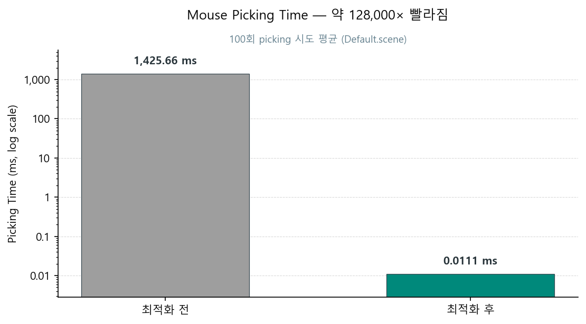
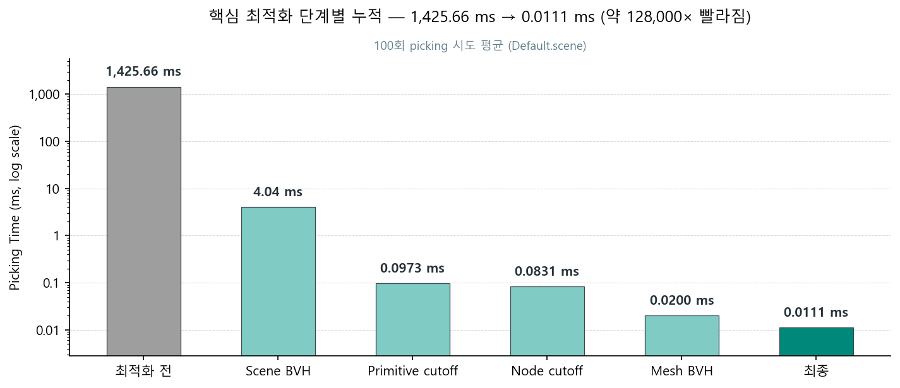
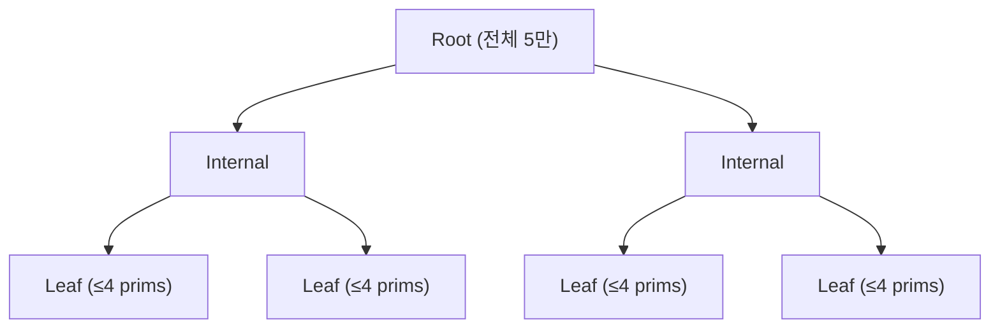
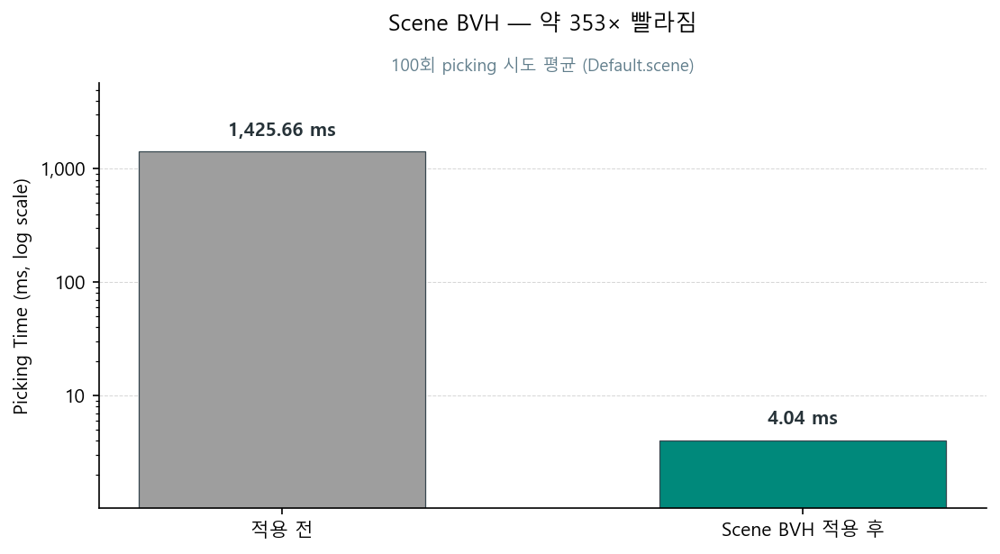
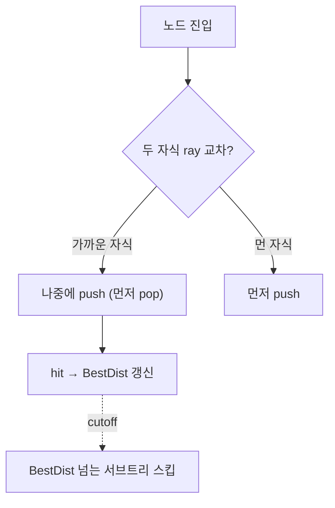
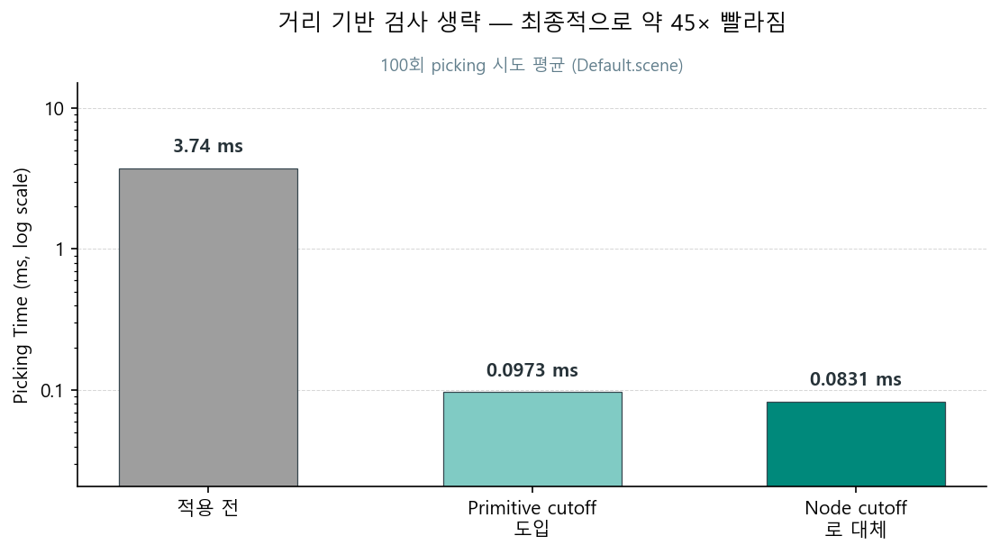
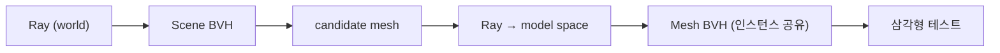
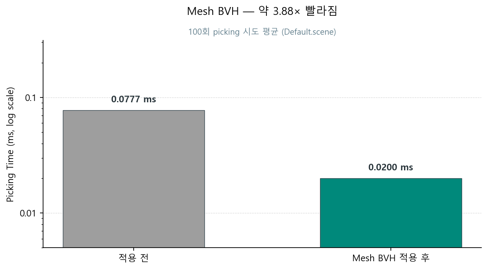

# Mouse Picking 최적화

## 1. 성과



| 구분 | 측정 화면 |
|:----:|:---------:|
| Picking Time (100회 평균) | [before](../screenshots/picking-time-scenebvh-before.png) · [after](../screenshots/picking-time-final.png) |

`Default.scene` 기준으로 **모든 최적화 적용 후** mouse picking 시간을 1,425.66 ms 에서 0.0111 ms 까지 줄였습니다 (각 100회 평균). "최적화 후" 수치는 이번 과제에서 제가 했던 최적화가 모두 누적된 시점([`9b540ef`](https://github.com/nansu0425/GameTechLab-WEEK05/commit/9b540ef))의 측정값입니다.

## 2. 배경

| 기간 | 리포지토리 | 커밋 기록 |
|------|-----------|----------|
| 2025-09-26 ~ 2025-09-30 | [GameTechLab-WEEK05](https://github.com/nansu0425/GameTechLab-WEEK05) | [41건](commit_history.md#week05-2025-09-26--2025-09-30) |

이번 과제에서 제 담당은 `Default.scene`의 mouse picking 시간 최적화 였습니다. 제가 최적화 하기 전 mouse picking은 씬의 모든 mesh를 선형 탐색하면서 ray-triangle 테스트하는 방식이었습니다. 

- **`Default.scene`** ([씬 캡처](../screenshots/default-scene.png)): 과제에서 picking 최적화 기준이 되는 씬입니다. 5만 개의 Static Mesh Actor가 배치돼 있습니다. Mesh는 `apple_mid.obj` (2,104 tri) / `bitten_apple_mid.obj` (2,014 tri) 두 종류만 존재합니다. 제약 사항이 존재했는데, Instanced Rendering을 사용하면 안되고 모든 Mesh는 Draw Call을 해야합니다.
- **측정 방식**: 100회 picking 시도하고, 누적 picking 시간을 100으로 나눠 평균 picking time 을 구했습니다. 모든 측정 시점에서 동일한 `Default.scene`·동일 카메라 상태·유사한 클릭 패턴으로 측정했습니다.
- **격리 측정**: 각 핵심 최적화의 효과를 *해당 최적화 한 가지의 효과* 로 격리하기 위해, *그 최적화를 도입한 핵심 커밋의 SHA* 에서 측정했습니다. 빨라진 비율은 *그 핵심 커밋의 직전(parent) commit 측정값* 을 분모로 계산해, 한 commit 이 가져온 효과만 정확히 보이도록 했습니다.
- **측정 환경**: 
    - Intel Core i7-14700HX
    - NVIDIA RTX 4060 Laptop GPU
    - 32GB DDR5
    - Windows 11

## 3. 핵심 최적화 과정

이 섹션은 picking을 빠르게 만드는 데 **효과가 컸던 핵심 최적화** 만 다룹니다. micro optimization (SoA 데이터 레이아웃, BVH 빌드/갱신 품질 보강 등) 은 최종 수치에는 반영되어 있지만, 이 섹션에서 설명을 생략합니다.



### 3-1. Scene BVH

최적화 전 picking은 scene의 모든 primitive를 선형 순회하며 ray 교차 테스트를 했습니다. 즉, candidate 탐색 시간복잡도가 `O(N)` 이었습니다. candidate 탐색 비용을 낮추고 싶었고, `O(log N)` 시간복잡도로 낮추기 위해 공간 분할(spatial partitioning) 자료구조 도입을 결정했습니다.

candidate로 Octree와 BVH(Bounding Volume Hierarchy)를 검토했습니다.

| 측면 | BVH | Octree |
|------|-----|--------|
| 분할 단위 | 객체 묶음의 AABB로 트리 구성 | 공간을 8등분(고정) |
| 분포 기준 | 분할 기준에 데이터 분포 반영 가능 | 중점 기반 균등 분할 |
| 동적 갱신 | 변경된 leaf·조상만 부분 갱신 | 셀 경계 넘는 이동은 재삽입 필요 |

`Default.scene` 뿐만 아니라 앞으로 다양한 게임 씬에서 picking 할 것을 고려할 때 Octree보다 BVH가 적합하다고 판단했습니다. 판단의 주요 근거는 두 가지 였습니다.

1. **객체 분포가 불균일**: 어떤 씬에서 객체가 어떻게 배치될지 미리 알 수 없습니다. Octree의 8등분 고정 분할은 빈 셀과 밀집 셀이 공존하기 쉽지만, BVH는 SAH(Surface Area Heuristic)로 객체 분포가 반영된 분할이 가능합니다.
2. **동적 씬**: 액터의 Transform은 실시간으로 바뀔 수 있습니다. BVH는 노드의 부모-자식 관계를 유지한 채 변경된 leaf와 그 조상의 AABB만 갱신하는 Refit이 가능한 반면, Octree는 객체가 셀 경계를 넘는 순간 재삽입이 필요합니다.



```cpp
// Before — 5만 primitive를 모두 순회하며 ray-primitive 테스트, 최단 hit 갱신: O(N)
for (UPrimitiveComponent* Prim : Primitives)                       // 5만 회
{
    if (IsRayPrimitiveCollided(Ray, Prim, &Dist) && Dist < ShortestDist)
    {
        ShortestPrim = Prim;
        ShortestDist = Dist;
    }
}
```

```cpp
// After — BVH 트리 순회: ray-AABB 가지치기로 서브트리 통째 스킵, leaf의 prim만 candidate로 수집: O(log N) 기댓값
int Stack[128]; int Sp = 0; Stack[Sp++] = 0;                       // root push
while (Sp > 0)
{
    const FNode& N = Nodes[Stack[--Sp]];
    if (!RayIntersectsAABB(Ray, N.Bounds)) continue;               // ray와 안 만나면 서브트리 전체 스킵
    if (N.IsLeaf())
    {
        for (int i = 0; i < N.Count; ++i)                          // leaf의 ≤4 prim 수집
            Candidate.push_back(Primitives[Indices[N.Start + i]]);
    }
    else
    {
        Stack[Sp++] = N.Left;                                      // 두 자식 push
        Stack[Sp++] = N.Right;
    }
}
// 좁혀진 Candidate에 대해서만 위 Before와 동일한 정밀 검사 수행
```

5만 `Primitives` 선형 순회(`O(N)`)를 트리 순회(`O(log N)`)로 바꾼 것만으로 약 **353× 빨라졌습니다**.

#### 측정 결과 — 약 353× 빨라짐



| 단계 | SHA (after) | parent SHA | 측정 화면 |
|------|:------------:|:------------:|:---------:|
| Scene BVH 도입 | [`1233ffd`](https://github.com/nansu0425/GameTechLab-WEEK05/commit/1233ffd) | [`fbe3a5b`](https://github.com/nansu0425/GameTechLab-WEEK05/commit/fbe3a5b) | [before](../screenshots/picking-time-scenebvh-before.png) · [after](../screenshots/picking-time-scenebvh.png) |

### 3-2. 거리 기반 검사 생략

3-1의 BVH가 candidate 탐색에서 약 353× 빨라진 후에는, BVH가 반환한 candidate에 대한 정밀 ray-triangle 검사가 picking 시간의 주요 병목이었습니다. 이 검사 단계에서 *모든 candidate를 검사하지 않고 가까운 candidate부터 검사하면* 더 빨라질 수 있을 것이라고 판단했습니다. ray와 여러 candidate가 교차한다면, picking의 경우 가까운 오브젝트를 선택해야 합니다. 따라서 가까운 candidate의 ray 교차가 확인되면 뒤에 있는 candiate의 검사는 불필요합니다. 

#### Primitive cutoff — TMin 정렬 + BestDist 비교

BVH가 반환한 candidate의 ray-AABB TMin (ray가 AABB에 진입하는 거리) 을 계산하고, TMin 오름차순으로 정렬해 가까운 candidate부터 정밀 검사합니다. 검사 도중 hit 거리(`BestDist`)가 갱신되면 *그보다 먼 위치의 candidate가 발견되는 즉시 검사를 종료* 합니다.

```cpp
// candidate TMin 정렬 후 가까운 순으로 검사 + cutoff 조기 종료
for (int64 Idx : Order)
{
    if (CandidateTmins[Idx] > BestDist) break;     // ← 핵심 cutoff
    // ray-prim 정밀 검사 (Möller–Trumbore)
}
```

#### Primitive cutoff 의 한계 — 더 일찍 생략할 여지

Primitive cutoff 는 BVH 가 반환한 candidate 를 *받은 후에* 검사 생략을 적용합니다. 이 구조를 풀어서 설명하면 아래와 같습니다.

- BVH 트리 순회에서 ray 와 교차하는 *모든* leaf 의 prim 을 일단 candidate 배열에 다 모읍니다.
- 모든 candidate 의 TMin 을 계산하고 `std::sort` 로 정렬합니다.
- 검사 루프 안의 cutoff 가 일찍 break 시켜도, *수집·정렬에 든 비용* 은 이미 발생한 뒤입니다.

거리 기반 생략을 *BVH 트리 순회 과정* 안으로 옮겨서 ray 와 교차하는 서브트리 및 leaf 단위로 검사 생략을 적용한다면 candidate 수집·정렬 비용을 제거할 수 있습니다. 이 판단을 근거로 Node cutoff 방식으로 발전시켰습니다.

#### Node cutoff 로 대체 — front-to-back 순회 + 서브트리 스킵

Candidate 배열을 만들기 *전에* BVH 트리 순회 자체에서 거리 기반 생략을 수행합니다. 두 자식 노드 모두 ray 와 교차할 때 가까운 자식이 먼저 pop 되도록 stack에 push 합니다. hit 갱신 후 *현재 `BestDist` 보다 먼 노드는 방문 생략* 합니다.



```cpp
// Node cutoff 핵심 — 노드 스택에 (Index, TMin) 쌍을 저장. 가까운 자식 우선 방문 + 서브트리 스킵
struct FEntry { int64 Index; float TMin; };
Stack.push_back({ root, RootTMin });

while (!Stack.empty())
{
    FEntry E = Stack.back(); Stack.pop_back();
    if (E.TMin > BestDist) continue;                                  // ★ 노드 cutoff: 서브트리 통째 스킵

    const FNode& N = Nodes[E.Index];
    if (N.IsLeaf())
    {
        for (prim in leaf) PreciseTest(prim, BestDist);               // hit 시 BestDist 갱신
    }
    else
    {
        // 두 자식 AABB 의 TMin 계산. BestDist 보다 먼 자식은 push 자체를 안 함
        const bool bL = (LTMin <= BestDist);
        const bool bR = (RTMin <= BestDist);
        if (bL && bR)
        {
            // ★ front-to-back: 먼 쪽 먼저 push → LIFO 로 가까운 쪽이 다음에 먼저 pop
            if (LTMin < RTMin) { Stack.push_back({N.Right, RTMin}); Stack.push_back({N.Left,  LTMin}); }
            else               { Stack.push_back({N.Left,  LTMin}); Stack.push_back({N.Right, RTMin}); }
        }
        else if (bL) Stack.push_back({N.Left,  LTMin});
        else if (bR) Stack.push_back({N.Right, RTMin});
    }
}
```

#### Node cutoff 가 더 빠른 4가지 이유

1. **불필요한 leaf 방문 자체가 사라짐** — Primitive cutoff 는 ray 와 BVH 가 교차하는 *모든* leaf 의 prim 을 일단 다 수집합니다. Node cutoff 는 가까운 leaf 에서 hit 발견 시 *먼 leaf 는 아예 방문 안 함*.
2. **candidate 수집·정렬 오버헤드 제거** — Primitive cutoff 의 TMin 계산 (모든 candidate) 과 `std::sort` 가 통째로 사라집니다.
3. **heap 할당 0** — Primitive cutoff 는 `Candidate`, `CandidateTmins`, `Order` 세 배열을 heap 에 할당합니다. Node cutoff 는 stack (`int Stack[128]`) 만 사용.
4. **cutoff 메커니즘 자체의 차이** — Primitive cutoff 는 *수집된 배열* 안의 `break` 로 *남은 정밀 검사* 를 종료합니다. 다만 그 candidate 들의 *수집·TMin 계산·정렬은 이미 발생한 비용* 이라 회수되지 않습니다. Node cutoff 는 *순회 중 `continue`* 로 *서브트리 진입 자체* 를 안 합니다 — 그 서브트리의 prim 이 candidate 로 수집되지도 않습니다.

#### 측정 결과 — Primitive cutoff 도입 후 Node cutoff 로 대체, 최종적으로 약 45× 빨라짐



| 단계 | SHA (after) | parent SHA | 측정 화면 |
|------|:------------:|:------------:|:---------:|
| Primitive cutoff 도입 | [`5cd01ac`](https://github.com/nansu0425/GameTechLab-WEEK05/commit/5cd01ac) | [`17a1511`](https://github.com/nansu0425/GameTechLab-WEEK05/commit/17a1511) | [before](../screenshots/picking-time-candidate-cutoff-before.png) · [after](../screenshots/picking-time-candidate-cutoff.png) |
| Primitive cutoff → Node cutoff 로 대체 | [`a24a329`](https://github.com/nansu0425/GameTechLab-WEEK05/commit/a24a329) | [`5cd01ac`](https://github.com/nansu0425/GameTechLab-WEEK05/commit/5cd01ac) | [before](../screenshots/picking-time-candidate-cutoff.png) · [after](../screenshots/picking-time-bvh-cutoff.png) |

Primitive cutoff 도입 직전([`17a1511`](https://github.com/nansu0425/GameTechLab-WEEK05/commit/17a1511) 평균 3.74 ms) 에서 최종 Node cutoff 적용 후([`a24a329`](https://github.com/nansu0425/GameTechLab-WEEK05/commit/a24a329) 평균 0.0831 ms) 까지 약 **45× 빨라졌습니다**.

### 3-3. Mesh BVH

 Scene BVH가 정밀 판정 대상이 되는 candidate를 충분히 적은 수로 좁힐 수 있는 상태가 됐고, 더 이상 candidate를 좁히는 방식으로 최적화하긴 어려워 보였습니다. 그래서 candidate를 좁히는 방식이 아닌 정밀 판정 자체의 시간을 줄이기 위한 최적화 방법을 시도하기로 했습니다. 이 시점에선 정밀 판정 시 내부 mesh의 모든 삼각형(~2,000개)을 선형 순회하는 상태였습니다. 이건 처음 Scene BVH 적용 전 비효율적인 상황과 비슷한 상황이었습니다. 그래서 scene 단위에서 적용한 트리 순회 최적화 방식을 mesh level에도 적용하는 최적화를 시도했습니다.



Scene BVH leaf의 per-primitive 정밀 검사에서 ~2,000 삼각형을 선형 순회하는 대신, mesh의 삼각형으로 빌드된 Mesh BVH에 진입합니다. Mesh BVH의 `TraverseFrontToBack`은 3-2의 Scene BVH와 동일한 front-to-back + cutoff 순회 패턴을 재사용합니다. Scene BVH는 world space에서 동작하지만 Mesh BVH는 model space에서 빌드되어 있으므로, candidate mesh 진입 시 ray를 instance의 model space로 변환합니다. Scene BVH의 `BestDist`(world space)는 model ray direction의 world 변환 길이로 나눠 model space `CutoffT`로 전파됩니다.

```cpp
// Before — candidate mesh의 ~2,000 삼각형 전부 선형 순회
for (int32 TriIndex = 0; TriIndex < NumTriangles; ++TriIndex)               // ~2,000 회
{
    IsRayTriangleCollided(..., v0, v1, v2, ...);
}
```

```cpp
// After — Mesh BVH로 삼각형 서브트리 스킵, Scene BVH의 BestDist가 CutoffT로 전파
float CutoffT = BestDist / ModelToWorldDirLength;                           // world → model 거리 변환
MBVH->TraverseFrontToBack(ModelRay, CutoffT, [&](int32 TriIndex) {
    IsRayTriangleCollided(..., v0, v1, v2, ...);                            // leaf의 삼각형만 정밀 검사
});
```

`Default.scene`에서 사용되는 mesh 종류는 `apple_mid.obj` / `bitten_apple_mid.obj` 두 가지뿐입니다. Mesh BVH는 `UAssetManager`가 mesh asset당 하나만 빌드한 뒤 모든 instance가 공유하므로 빌드 2회로 5만 instance를 커버합니다.

Mesh level 최적화 적용 후 약 **3.88× 빨라졌습니다**.

#### 측정 결과 — 약 3.88× 빨라짐



| 단계 | SHA (after) | parent SHA | 측정 화면 |
|------|:------------:|:------------:|:---------:|
| Mesh BVH 도입 | [`cc8fe27`](https://github.com/nansu0425/GameTechLab-WEEK05/commit/cc8fe27) | [`919c3ed`](https://github.com/nansu0425/GameTechLab-WEEK05/commit/919c3ed) | [before](../screenshots/picking-time-mesh-bvh-before.png) · [after](../screenshots/picking-time-mesh-bvh.png) |

## 4. 회고

### 4-1. GPU Object ID Picking

과제가 끝난 뒤 *editor 의 표준적인 picking 방식은 GPU 측에서 object ID 를 render target 에 기록하고 마우스 좌표 위치의 픽셀을 읽어 ID 를 얻는 방식* 이라는 것을 알게 됐습니다. 이 방식은 객체·삼각형 개수와 무관하게 1 pixel 에 대한 GPU readback 한 번이면 object ID 를 알 수 있습니다. 당시에는 GPU 를 활용하는 프로그래밍이 생소하게 느껴져서, picking 을 GPU 로 처리하는 방식을 고려하지 않았습니다. GPU 프로그래밍에 대한 이해도가 현재 수준이었다면 GPU object ID picking 을 먼저 시도했을 것 같습니다.

### 4-2. BVH 시각화 도구

Scene BVH 와 Mesh BVH 를 구현하면서, 노드의 AABB 와 트리 구조가 *제가 의도한 대로* 빌드됐는지 확인할 수단은 picking 결과의 정확성과 시간 측정뿐이었습니다. 노드 AABB 를 wireframe 으로 그려주는 디버그 시각화 기능이 있었다면 트리 분할 및 순회 경로를 눈으로 검증할 수 있어 디버깅 비용을 크게 줄였을 것 같습니다. 복잡한 자료구조를 구현할 때는 시각화 도구를 초기에 만드는 것이 추후 디버깅과 최적화 비용을 아끼기 위해 필수라고 느꼈습니다.

### 4-3. 정량적 프로파일링 기반 병목 식별

*어디가 주요 병목인지* 를 정량적 프로파일링이 아니라 코드를 읽고 어림짐작한 뒤 최적화 대상으로 삼았습니다. 이번 과제에서는 초반에 그 짐작이 잘 들어맞아 큰 가속을 얻었지만, 후반에 micro optimization 을 수행할 때부터는 기대만큼의 효과 없이 코드만 복잡해진 경우가 많았습니다. 이런 코드가 쌓이기 시작하니 어떤 것이 진짜 최적화 코드이고, 어떤 것이 불필요한 코드인지 구분할 수 없는 문제가 생겼습니다. 문제 원인을 생각해보면, 일정 수준 이상 복잡도가 올라갈수록 병목이라고 추측하는 지점과 *실제 병목 지점이 다른 case* 가 많아지는 게 원인인 것 같습니다. 다시 이 과제를 한다면 프로파일링했을 때 정량적 수치로 확인되는 병목 지점만 최적화를 시도할 것입니다.
