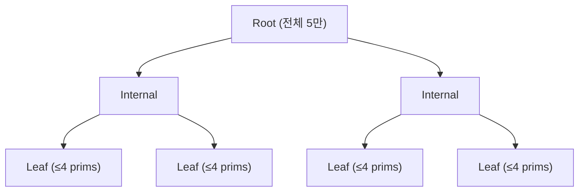
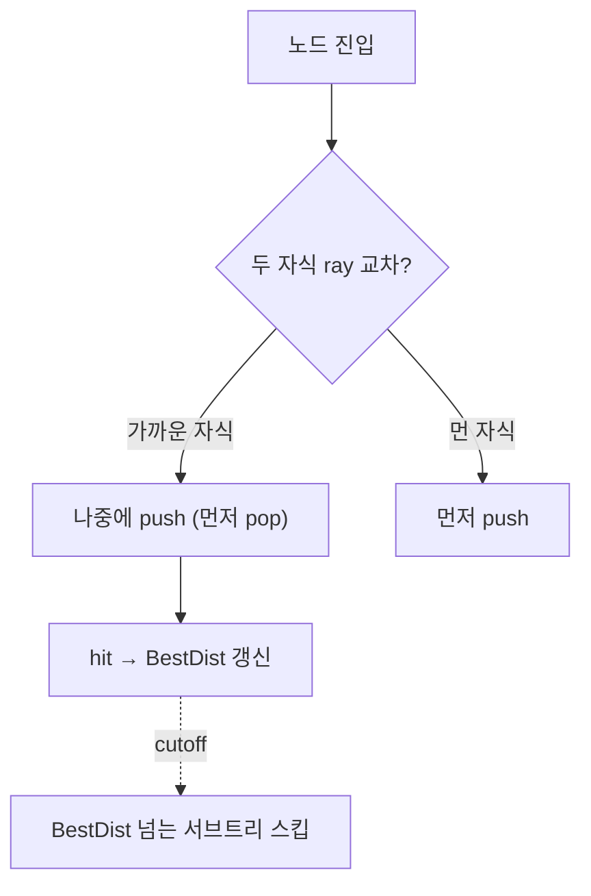
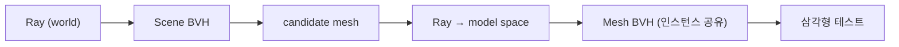

# Mouse Picking 최적화

## 1. 성과 (한눈에)


*원본 측정 화면: [stage-0.png](../screenshots/stage-0.png)*


*원본 측정 화면: [stage-5.png](../screenshots/stage-5.png)*

| 구분 | 최적화 전 | 최적화 후 | 단축 비율 |
|:----:|:--------------------:|:---------------------:|:--------:|
| Picking Time | **1,682 ms** | **0.030 ms** | 약 **56,000배** |

 `Default.scene` 기준으로 mouse picking 시간을 1,682ms에서 0.03ms까지 줄였습니다.

## 2. 배경

| 기간 | 리포지토리 | 커밋 기록 |
|------|-----------|----------|
| 2025-09-26 ~ 2025-09-30 | [GameTechLab-WEEK05](https://github.com/nansu0425/GameTechLab-WEEK05) | [41건](commit_history.md#week05-2025-09-26--2025-09-30) |

이번 과제에서 제 담당은 `Default.scene`의 mouse picking 시간 최적화 였습니다. 제가 최적화 하기 전 mouse picking은 씬의 모든 mesh를 선형 탐색하면서 ray-triangle 테스트하는 방식이었습니다. 

- **`Default.scene`** ([씬 캡처](../screenshots/default-scene.png)): 과제에서 picking 최적화 기준이 되는 씬입니다. 5만 개의 Static Mesh Actor가 배치돼 있습니다. Mesh는 `apple_mid.obj` (2,104 tri) / `bitten_apple_mid.obj` (2,014 tri) 두 종류만 존재합니다. 제약 사항이 존재했는데, Instanced Rendering을 사용하면 안되고 모든 Mesh는 Draw Call을 해야합니다.
- **측정 도구**: `FScopeCycleCounter`로 picking 진입~반환 구간을 감싸서 Picking 시도를 할 때마다 `FThreadStats`에 Picking 시간 및 횟수를 누적합니다. 기록된 Picking 시간은 ms 단위로 화면 좌상단에 표시됩니다. 콘솔에서 `stat picking` Command 입력 시 활성화됩니다.
- **측정 환경**: 
    - Intel Core i7-14700HX
    - NVIDIA RTX 4060 Laptop GPU
    - 32GB DDR5
    - Windows 11

## 3. 4단계 최적화 과정

### 3-1. Scene BVH 도입 — 5만 candidate 탐색을 `O(N)`에서 `O(log N)`으로

최적화 전 picking은 scene의 모든 primitive를 선형 순회하며 ray 교차 테스트를 했습니다. 즉, candidate 탐색 시간복잡도가 `O(N)` 이었습니다. candidate 탐색 비용을 낮추고 싶었고, `O(log N)` 시간복잡도로 낮추기 위해 공간 분할(spatial partitioning) 자료구조 도입을 결정했습니다.

candidate로 Octree와 BVH(Bounding Volume Hierarchy)를 검토했습니다.

| 측면 | BVH | Octree |
|------|-----|--------|
| 분할 단위 | 객체 묶음의 AABB로 트리 구성 | 공간을 8등분(고정) |
| 분포 기준 | 분할 기준에 데이터 분포 반영 가능 | 중점 기반 균등 분할 |
| 동적 갱신 | 변경된 leaf·조상만 부분 갱신 | 셀 경계 넘는 이동은 재삽입 필요 |

`Default.scene` 뿐만 아니라 앞으로 다양한 게임 씬에서 picking 할 것을 고려할 때 Octree보다 BVH가 적합하다고 판단했습니다. 판단의 주요 근거는 두 가지 였습니다.

1. **객체 분포가 불균일**: 어떤 씬에서 객체가 어떻게 배치될지 미리 알 수 없습니다. Octree의 8등분 고정 분할은 빈 셀과 밀집 셀이 공존하기 쉽지만, BVH는 SAH(Surface Area Heuristic)로 객체 분포가 반영된 분할이 가능합니다.
2. **동적 씬**: 액터의 Transform은 실시간으로 바뀔 수 있습니다. BVH는 노드의 부모-자식 관계를 유지한 채 변경된 leaf와 그 조상의 AABB만 갱신하는 Refit이 가능한 반면, Octree는 객체가 셀 경계를 넘는 순간 재삽입이 필요합니다.



```cpp
// Before — 5만 primitive를 모두 순회하며 ray-primitive 테스트, 최단 hit 갱신: O(N)
for (UPrimitiveComponent* Prim : Primitives)                       // 5만 회
{
    if (IsRayPrimitiveCollided(Ray, Prim, &Dist) && Dist < ShortestDist)
    {
        ShortestPrim = Prim;
        ShortestDist = Dist;
    }
}
```

```cpp
// After — BVH 트리 순회: ray-AABB 가지치기로 서브트리 통째 스킵, leaf의 prim만 candidate로 수집: O(log N) 기댓값
int Stack[128]; int Sp = 0; Stack[Sp++] = 0;                       // root push
while (Sp > 0)
{
    const FNode& N = Nodes[Stack[--Sp]];
    if (!RayIntersectsAABB(Ray, N.Bounds)) continue;               // ray와 안 만나면 서브트리 전체 스킵
    if (N.IsLeaf())
    {
        for (int i = 0; i < N.Count; ++i)                          // leaf의 ≤4 prim 수집
            Candidate.push_back(Primitives[Indices[N.Start + i]]);
    }
    else
    {
        Stack[Sp++] = N.Left;                                      // 두 자식 push
        Stack[Sp++] = N.Right;
    }
}
// 좁혀진 Candidate에 대해서만 위 Before와 동일한 정밀 검사 수행
```

5만 `Primitives` 선형 순회(`O(N)`)를 트리 순회(`O(log N)`)로 바꾼 것만으로 **1,682 ms → 10 ms**, 약 158배 단축됐습니다. ([PR #12](https://github.com/Sunha-i/GTLWeek05/pull/12) · [측정 화면](../screenshots/stage-1.png))

이후 BVH 자체의 빌드/갱신 품질 보강도 함께 적용했습니다. 분할 기준은 Binned SAH (32 bin), 동적 갱신은 변경된 leaf 와 그 조상 경로만 갱신하는 Dirty Refit 입니다. 다만 `Default.scene` 의 균등 격자 분포에서는 picking 시간 자체에 큰 영향을 주지 않았습니다. ([PR #13](https://github.com/Sunha-i/GTLWeek05/pull/13))

### 3-2. 거리 기반 검사 생략

3-1의 BVH가 candidate 탐색을 158× 단축한 후에는, BVH가 반환한 candidate에 대한 정밀 ray-triangle 검사가 picking 시간의 주요 병목이었습니다. 이 검사 단계에서 *모든 candidate를 검사하지 않고 가까운 candidate부터 검사하면* 큰 시간 단축이 가능할 것이라고 판단했습니다. ray와 여러 candidate가 교차한다면, picking의 경우 가까운 오브젝트를 선택해야 합니다. 따라서 가까운 candidate의 ray 교차가 확인되면 뒤에 있는 candiate의 검사는 불필요합니다. 

#### Candidate level — TMin 정렬 + BestDist cutoff

BVH가 반환한 candidate의 ray-AABB TMin (ray가 AABB에 진입하는 거리) 을 계산하고, TMin 오름차순으로 정렬해 가까운 candidate부터 정밀 검사합니다. 검사 도중 hit 거리(`BestDist`)가 갱신되면 *그보다 먼 위치의 candidate가 발견되는 즉시 검사를 종료* 합니다.

```cpp
// candidate TMin 정렬 후 가까운 순으로 검사 + cutoff 조기 종료
for (int64 Idx : Order)
{
    if (CandidateTmins[Idx] > BestDist) break;     // ← 핵심 cutoff
    // ray-prim 정밀 검사 (Möller–Trumbore)
}
```

#### Candidate level 의 한계 — 더 일찍 생략할 여지

Candidate level 은 BVH 가 반환한 candidate 를 *받은 후에* 검사 생략을 적용합니다. 이 구조를 풀어서 설명하면 아래와 같습니다.

- BVH 트리 순회에서 ray 와 교차하는 *모든* leaf 의 prim 을 일단 candidate 배열에 다 모읍니다.
- 모든 candidate 의 TMin 을 계산하고 `std::sort` 로 정렬합니다.
- 검사 루프 안의 cutoff 가 일찍 break 시켜도, *수집·정렬에 든 비용* 은 이미 발생한 뒤입니다.

거리 기반 생략을 *BVH 트리 순회 과정* 안으로 옮겨서 ray 와 교차하는 서브트리 및 leaf 단위로 검사 생략을 적용한다면 candidate 수집·정렬 비용을 제거할 수 있습니다. 이 판단을 근거로 BVH level 거리 기반 생략 방식으로 발전시켰습니다.

#### BVH level 로 대체 — front-to-back 순회 + 노드 cutoff

Candidate 배열을 만들기 *전에* BVH 트리 순회 자체에서 거리 기반 생략을 수행합니다. 두 자식 노드 모두 ray 와 교차할 때 가까운 자식이 먼저 pop 되도록 stack에 push 합니다. hit 갱신 후 *현재 `BestDist` 보다 먼 노드는 방문 생략* 합니다.



```cpp
// BVH level 핵심 — 노드 스택에 (Index, TMin) 쌍을 저장. 가까운 자식 우선 방문 + 노드 단위 cutoff
struct FEntry { int64 Index; float TMin; };
Stack.push_back({ root, RootTMin });

while (!Stack.empty())
{
    FEntry E = Stack.back(); Stack.pop_back();
    if (E.TMin > BestDist) continue;                                  // ★ 노드 cutoff: 서브트리 통째 스킵

    const FNode& N = Nodes[E.Index];
    if (N.IsLeaf())
    {
        for (prim in leaf) PreciseTest(prim, BestDist);               // hit 시 BestDist 갱신
    }
    else
    {
        // 두 자식 AABB 의 TMin 계산. BestDist 보다 먼 자식은 push 자체를 안 함
        const bool bL = (LTMin <= BestDist);
        const bool bR = (RTMin <= BestDist);
        if (bL && bR)
        {
            // ★ front-to-back: 먼 쪽 먼저 push → LIFO 로 가까운 쪽이 다음에 먼저 pop
            if (LTMin < RTMin) { Stack.push_back({N.Right, RTMin}); Stack.push_back({N.Left,  LTMin}); }
            else               { Stack.push_back({N.Left,  LTMin}); Stack.push_back({N.Right, RTMin}); }
        }
        else if (bL) Stack.push_back({N.Left,  LTMin});
        else if (bR) Stack.push_back({N.Right, RTMin});
    }
}
```

#### BVH level 이 더 빠른 4가지 이유

1. **불필요한 leaf 방문 자체가 사라짐** — Candidate level 은 ray 와 BVH 가 교차하는 *모든* leaf 의 prim 을 일단 다 수집합니다. BVH level 은 가까운 leaf 에서 hit 발견 시 *먼 leaf 는 아예 방문 안 함*.
2. **candidate 수집·정렬 오버헤드 제거** — Candidate level 의 TMin 계산 (모든 candidate) 과 `std::sort` 가 통째로 사라집니다.
3. **heap 할당 0** — Candidate level 은 `Candidate`, `CandidateTmins`, `Order` 세 배열을 heap 에 할당합니다. BVH level 은 stack (`int Stack[128]`) 만 사용.
4. **cutoff 메커니즘 자체의 차이** — Candidate level 의 cutoff 는 *수집된 배열* 안의 `break` 로 *남은 정밀 검사* 를 종료합니다. 다만 그 candidate 들의 *수집·TMin 계산·정렬은 이미 발생한 비용* 이라 회수되지 않습니다. BVH level 의 cutoff 는 *순회 중 `continue`* 로 *서브트리 진입 자체* 를 안 합니다 — 그 서브트리의 prim 이 candidate 로 수집되지도 않습니다.

#### 측정 결과 — 누적 약 185×

| 단계 | Picking Time | 직전 단계 대비 |
|------|:------------:|:-------------:|
| Scene BVH only | 10 ms | — |
| + Candidate level | 0.150 ms | 약 67× |
| + BVH level (front-to-back) | 0.054 ms | 약 2.78× |

10 ms → 0.054 ms, **약 185× 누적 단축**.

([PR #13](https://github.com/Sunha-i/GTLWeek05/pull/13) · [PR #14](https://github.com/Sunha-i/GTLWeek05/pull/14) · [측정 화면 — Candidate level](../screenshots/stage-2.png) · [측정 화면 — BVH level](../screenshots/stage-3.png))

### 3-3. Mesh BVH (2-Level)

 Scene BVH가 정밀 판정할 소수 candidate로 충분히 좁힐 수 있는 상태가 됐고, 더 이상 candidate를 좁히는 방식으로 최적화하긴 어려워 보였습니다. 그래서 candidate를 좁히는 방식이 아닌 정밀 판정 자체의 시간을 줄이기 위한 최적화 방법을 시도하기로 했습니다. 이 시점에선 정밀 판정 시 내부 mesh의 모든 삼각형(~2,000개)을 선형 순회하는 상태였습니다. 이건 처음 Scene BVH 적용 전 비효율적인 이유와 비슷한 상황이었습니다. 그래서 scene 단위에서 적용한 트리 순회 최적화 방식을 mesh level에도 적용하는 최적화를 시도했습니다.



Scene BVH leaf의 per-primitive 정밀 검사에서 ~2,000 삼각형을 선형 순회하는 대신, mesh의 삼각형으로 빌드된 Mesh BVH에 진입합니다. Mesh BVH의 `TraverseFrontToBack`은 3-2의 Scene BVH와 동일한 front-to-back + cutoff 순회 패턴을 재사용합니다. Scene BVH는 world space에서 동작하지만 Mesh BVH는 model space에서 빌드되어 있으므로, candidate mesh 진입 시 ray를 instance의 model space로 변환합니다. Scene BVH의 `BestDist`(world space)는 model ray direction의 world 변환 길이로 나눠 model space `CutoffT`로 전파됩니다.

```cpp
// Before — candidate mesh의 ~2,000 삼각형 전부 선형 순회
for (int32 TriIndex = 0; TriIndex < NumTriangles; ++TriIndex)               // ~2,000 회
{
    IsRayTriangleCollided(..., v0, v1, v2, ...);
}
```

```cpp
// After — Mesh BVH로 삼각형 서브트리 스킵, Scene BVH의 BestDist가 CutoffT로 전파
float CutoffT = BestDist / ModelToWorldDirLength;                           // world → model 거리 변환
MBVH->TraverseFrontToBack(ModelRay, CutoffT, [&](int32 TriIndex) {
    IsRayTriangleCollided(..., v0, v1, v2, ...);                            // leaf의 삼각형만 정밀 검사
});
```

`Default.scene`에서 사용되는 mesh 종류는 `apple_mid.obj` / `bitten_apple_mid.obj` 두 가지뿐입니다. Mesh BVH는 `UAssetManager`가 mesh asset당 하나만 빌드한 뒤 모든 instance가 공유하므로 빌드 2회로 5만 instance를 커버합니다.

Mesh level 최적화 적용 후 **0.054 ms → 0.031 ms**, 약 1.7배 picking 시간이 단축됐습니다. ([PR #15](https://github.com/Sunha-i/GTLWeek05/pull/15) · [측정 화면](../screenshots/stage-4.png))

### 3-4. SoA 데이터 레이아웃 — 캐시 친화적 핫패스

```
AoS: [X Y Z][X Y Z][X Y Z]...   한 정점 9 float가 인접
SoA: [X X X ...][Y Y Y ...][Z Z Z ...]   같은 축이 인접
```

```cpp
// PR #20 — 삼각형 데이터를 축별로 분리 저장
mutable TArray<float> TriV0X, TriV0Y, TriV0Z;
mutable TArray<float> TriE1X, TriE1Y, TriE1Z;
mutable TArray<float> TriE2X, TriE2Y, TriE2Z;
// 핫패스에서 인덱스로 9 float 순차 접근
inline void GetTriV0E1E2(int32 TriIdx, FVector& OutV0, FVector& OutE1, FVector& OutE2) const;
```

Möller–Trumbore 핫패스가 v0/e1/e2 9 float를 순차 접근하는 구조라 SoA가 L1 캐시 라인을 더 효율적으로 활용합니다. **0.031 ms → 0.030 ms**, 약 1.03배. `Default.scene`은 메시 종류가 두 가지뿐이라 캐시가 이미 친화적이어서 효과가 미세했지만, 메시 다양성이 큰 씬에서는 차이가 더 크게 드러날 것으로 예상됩니다. ([PR #20](https://github.com/Sunha-i/GTLWeek05/pull/20) · [측정 화면](../screenshots/stage-5.png))

### 누적 효과 종합

| 누적 최적화 | Picking Time | 직전 단계 대비 | 측정 화면 |
|:----------|:------------:|:-------------:|:---------:|
| (최적화 없음, 선형 탐색) | 1,682 ms | — | [stage-0](../screenshots/stage-0.png) |
| + Scene BVH | 10 ms | **약 158×** | [stage-1](../screenshots/stage-1.png) |
| + 거리 기반 가지치기 (candidate + BVH level) | 0.054 ms | **약 185×** | [stage-3](../screenshots/stage-3.png) |
| + Mesh BVH | 0.031 ms | 약 1.7× | [stage-4](../screenshots/stage-4.png) |
| + SoA 레이아웃 | 0.030 ms | 약 1.03× | [stage-5](../screenshots/stage-5.png) |

## 4. 선택의 근거와 트레이드오프

4단계의 핵심 결정에서 대안과의 비교를 정리합니다. 측정 결과로 각 결정을 검증했고, 거리 가지치기는 런타임 토글 분해 측정으로 dominant 요인 (candidate-level distance filter) 을 식별했습니다.

| 결정 | 채택 | 대안 | 채택 이유 / 비용 |
|------|------|------|----------------|
| 분할 기준 | Binned SAH (32 bin) | Midpoint split | SAH는 트래버설 비용 기댓값을 직접 최소화 → 트래버설 시간 단축. 빌드 시간 증가는 한 번 빌드 후 Refit으로 상쇄. |
| 동적 갱신 | Dirty Refit | 전체 Refit / 매 프레임 Rebuild | 매 프레임 Rebuild는 5만 prim SAH 재계산 비용이 큼. 전체 Refit도 5만 prim 전부의 World AABB 재계산. Dirty Refit은 변경된 leaf와 조상 경로만 갱신하고, 품질 점진 저하는 주기적 전체 Refit으로 보완. |
| 가속 구조 깊이 | 2-Level (Scene + Mesh) | 1-Level (Scene 안에 모든 삼각형) | 메시 인스턴싱 활용, Mesh BVH는 한 번만 빌드 후 재사용. Scene BVH 노드 수도 작아짐. |
| 메모리 레이아웃 | SoA | AoS | Möller–Trumbore 핫패스가 9 float를 순차 접근 → L1 캐시 라인 활용 극대화. 코드 가독성은 다소 손해. |
