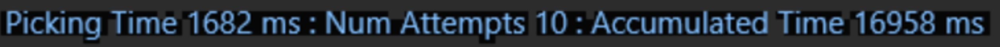
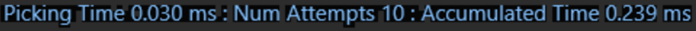
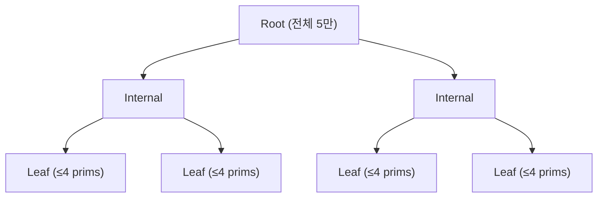
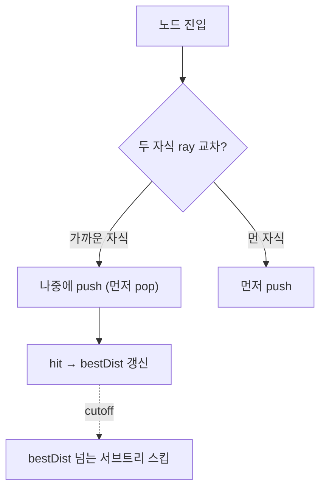
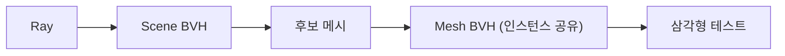

# Mouse Picking 최적화

## 1. 성과 (한눈에)


*원본 측정 화면: [stage-0.png](../screenshots/stage-0.png)*


*원본 측정 화면: [stage-5.png](../screenshots/stage-5.png)*

| 구분 | 최적화 전 | 최적화 후 | 단축 비율 |
|:----:|:--------------------:|:---------------------:|:--------:|
| Picking Time | **1,682 ms** | **0.030 ms** | 약 **56,000배** |

 `Default.scene` 기준으로 mouse picking 시간을 1,682ms에서 0.03ms까지 줄였습니다.

## 2. 배경

이번 과제에서 제 담당은 `Default.scene`의 mouse picking 시간 최적화 였습니다. 제가 최적화 하기 전 mouse picking은 씬의 모든 mesh를 선형 탐색하면서 ray-triangle 테스트하는 방식이었습니다. 

- **`Default.scene`** ([씬 캡처](../screenshots/default-scene.png)): 과제에서 picking 최적화 기준이 되는 씬입니다. 5만 개의 Static Mesh Actor가 배치돼 있습니다. Mesh는 `apple_mid.obj` (2,104 tri) / `bitten_apple_mid.obj` (2,014 tri) 두 종류만 존재합니다. 제약 사항이 존재했는데, Instanced Rendering을 사용하면 안되고 모든 Mesh는 Draw Call을 해야합니다.
- **측정 도구**: `FScopeCycleCounter`로 picking 진입~반환 구간을 감싸서 Picking 시도를 할 때마다 `FThreadStats`에 Picking 시간 및 횟수를 누적합니다. 기록된 Picking 시간은 ms 단위로 화면 좌상단에 표시됩니다. 콘솔에서 `stat picking` Command 입력 시 활성화됩니다.
- **측정 환경**: 
    - Intel Core i7-14700HX
    - NVIDIA RTX 4060 Laptop GPU
    - 32GB DDR5
    - Windows 11

## 3. 5단계 누적 최적화

각 단계는 한 PR로 머지된 한 가지 핵심 최적화에 대응합니다. 코드 발췌는 해당 단계 PR 머지 시점의 코드입니다.

### 3-1. Scene BVH 도입 — 5만 후보를 트리로 좁히기



```cpp
// FBVH — median split 기반 BVH (PR #12)
void Build(const TArray<UPrimitiveComponent*>& InPrimitives);
void QueryRay(const FRay& Ray, TArray<UPrimitiveComponent*>& OutCandidates) const;
```

선형 5만 ray-primitive 테스트를 트리 트래버설로 바꾼 것만으로 **1,682 ms → 10 ms**, 약 158배 단축. 가장 큰 도약은 가속 구조 도입 그 자체에서 일어났습니다. ([PR #12](https://github.com/Sunha-i/GTLWeek05/pull/12) · [측정 화면](../screenshots/stage-1.png))

### 3-2. SAH + Dirty Refit — 분할 품질과 동적 갱신


```cpp
// PR #13 — Binned SAH (32 bin)
constexpr int32 BinCount = 32;
// 각 축마다: bin 분배 → 좌/우 누적 AABB·count → cost = SA(L)*NL + SA(R)*NR
// 최소 cost split을 채택. 동적 갱신은 RefitDirty()로 변경된 leaf만 갱신.
```

분할 기준을 median에서 SAH로 바꾸자 트래버설 비용 기댓값이 직접 최소화되어 **10 ms → 0.150 ms**, 약 67배 추가 단축. 같은 PR에서 도입된 Dirty Refit은 액터 이동 시 변경된 leaf와 그 조상만 갱신해 매 프레임 rebuild 비용을 회피했습니다. ([PR #13](https://github.com/Sunha-i/GTLWeek05/pull/13) · [측정 화면](../screenshots/stage-2.png))

### 3-3. Front-to-back + 조기 가지치기 — 트래버설 안에서 자르기



```cpp
// PR #14 — 두 자식이 모두 ray와 교차할 때 가까운 쪽이 먼저 pop되도록 정렬 push
// 먼 쪽 먼저 push -> 스택 LIFO에 의해 가까운 쪽이 다음에 먼저 팝됨
// hit 갱신 후 cutoffT(현재 best 거리)를 넘는 서브트리는 즉시 가지치기
```

후보 배열을 만들어 정렬하던 단계가 사라지고, BVH 내부에서 bestDist 기준으로 노드·리프 수준에서 바로 잘라냈습니다. **0.150 ms → 0.054 ms**, 약 1.6배. ([PR #14](https://github.com/Sunha-i/GTLWeek05/pull/14) · [측정 화면](../screenshots/stage-3.png))

### 3-4. Mesh BVH (2-Level) + Back-face Culling — 그라뉼래리티를 한 단계 더



```cpp
// PR #15 — Scene BVH leaf에서 Mesh BVH로 진입
if (const FStaticMeshBVH* MBVH = UAssetManager::GetInstance().GetStaticMeshBVH(Mesh))
{
    MBVH->TraverseFrontToBack(ModelRay, CutoffT, /* per-tri callback */);
}
// 삼각형 테스트 시 카메라 반대 면은 즉시 컷
if (Determinant >= 0.0f) return false;
```

씬 단계 후보 컬링 위에 메시 단계 후보 컬링을 한 번 더 얹었습니다. Mesh BVH는 한 번 빌드 후 모든 인스턴스가 공유합니다. 같은 PR의 back-face culling이 추가로 ray-triangle 테스트를 절반으로 줄였습니다. **0.054 ms → 0.031 ms**, 약 1.7배. ([PR #15](https://github.com/Sunha-i/GTLWeek05/pull/15) · [측정 화면](../screenshots/stage-4.png))

### 3-5. SoA 데이터 레이아웃 — 캐시 친화적 핫패스

```
AoS: [X Y Z][X Y Z][X Y Z]...   한 정점 9 float가 인접
SoA: [X X X ...][Y Y Y ...][Z Z Z ...]   같은 축이 인접
```

```cpp
// PR #20 — 삼각형 데이터를 축별로 분리 저장
mutable TArray<float> TriV0X, TriV0Y, TriV0Z;
mutable TArray<float> TriE1X, TriE1Y, TriE1Z;
mutable TArray<float> TriE2X, TriE2Y, TriE2Z;
// 핫패스에서 인덱스로 9 float 순차 접근
inline void GetTriV0E1E2(int32 TriIdx, FVector& OutV0, FVector& OutE1, FVector& OutE2) const;
```

Möller–Trumbore 핫패스가 v0/e1/e2 9 float를 순차 접근하는 구조라 SoA가 L1 캐시 라인을 더 효율적으로 활용합니다. **0.031 ms → 0.030 ms**, 약 1.25배. `Default.scene`은 메시 종류가 두 가지뿐이라 캐시가 이미 친화적이어서 효과가 미세했지만, 메시 다양성이 큰 씬에서는 차이가 더 크게 드러날 것으로 예상됩니다. ([PR #20](https://github.com/Sunha-i/GTLWeek05/pull/20) · [측정 화면](../screenshots/stage-5.png))

### 누적 효과 종합

| 누적 최적화 | Picking Time | 직전 단계 대비 | 측정 화면 |
|:----------|:------------:|:-------------:|:---------:|
| (최적화 없음, 선형 탐색) | 1,682 ms | — | [stage-0](../screenshots/stage-0.png) |
| + Scene BVH | 10 ms | **약 158×** | [stage-1](../screenshots/stage-1.png) |
| + SAH + Dirty Refit | 0.150 ms | 약 67× | [stage-2](../screenshots/stage-2.png) |
| + Front-to-back, 조기 가지치기 | 0.054 ms | 약 1.6× | [stage-3](../screenshots/stage-3.png) |
| + Mesh BVH, Back-face Culling | 0.031 ms | 약 1.7× | [stage-4](../screenshots/stage-4.png) |
| + SoA 레이아웃 | 0.030 ms | 약 1.25× | [stage-5](../screenshots/stage-5.png) |

## 4. 선택의 근거와 트레이드오프

5단계의 핵심 결정에서 대안과의 비교를 정리합니다. 측정 결과로 각 결정을 검증하고, 단계별 PR로 분리해 누적 효과를 추적할 수 있게 진행했습니다.

| 결정 | 채택 | 대안 | 채택 이유 / 비용 |
|------|------|------|----------------|
| 분할 기준 | Binned SAH (32 bin) | Median split | SAH는 트래버설 비용 기댓값을 직접 최소화 → 트래버설 시간 단축. 빌드 시간 증가는 한 번 빌드 후 refit으로 상쇄. |
| 동적 갱신 | Dirty Refit | 매 프레임 Rebuild / 무대응 | Rebuild는 5만 객체 SAH 재계산 비용이 큼. Refit은 트리 구조 재사용으로 변경된 leaf만 갱신. AABB 품질 저하는 주기적 rebuild로 보완 가능. |
| 가속 구조 깊이 | 2-Level (Scene + Mesh) | 1-Level (Scene 안에 모든 삼각형) | 메시 인스턴싱 활용, Mesh BVH는 한 번만 빌드 후 재사용. Scene BVH 노드 수도 작아짐. |
| 메모리 레이아웃 | SoA | AoS | Möller–Trumbore 핫패스가 9 float를 순차 접근 → L1 캐시 라인 활용 극대화. 코드 가독성은 다소 손해. |
